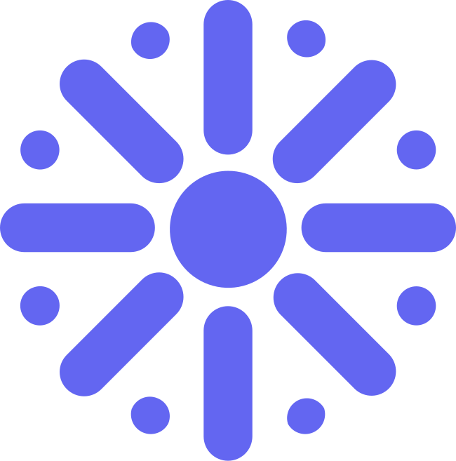

    
    <h1>Devparty</h1>
    <strong>The party hub for developers 🥳</strong>

 

    
    
    
    
    
    
    
    

     
    <a href="https://devparty.io"><b>devparty.io »</b></a>
      
    <a href="https://discord.gg/zxHM7uwDmk"><b>Discord</b></a>
    •
    <a href="https://devparty.io"><b>Website</b></a>
    •
    <a href="https://gitlab.com/yo/devparty/-/issues/new"><b>Issues</b></a>

## 🍭 About Devparty

The party hub for developers

## ✨ Feature Highlights

- 👤 **Users:** Community of developers who ships or creates constantly.
- 🚀 **Products:** Ship your products to Devparty and make regular updates about the product.
- 📜 **Posts:** Post what's happening in your desk or in your life and even post the desk pics.
- ✅ **Tasks:** All tasks are public and added to your profile.
- ❓ **Questions:** Get your questions answered and use this feature as discussion too.
- 🍔 **Topics:** Create and follow topic to stay updated on particular one.
- 👥 **Communities:** Join the public communities and keep yourself engaged and help others.
- 🌑 **Dark Mode:** A built-in light and dark color scheme.

## ✅ Community

For a place to have open discussions on features, voice your ideas, or get help with general questions please visit our community at [Discord](https://discord.gg/zxHM7uwDmk).

## 🤝 Contributing

We encourage you to contribute to Devparty! Please check out the [Contributing guide](CONTRIBUTING.md) for guidelines about how to proceed.

## ⚙️ Setup

## 💡 Acknowledgements

Special thanks to these amazing projects which help power Devparty:

- [Vercel](https://vercel.com/?utm_source=devparty&utm_campaign=oss)
- [Next.js](https://nextjs.org)
- [Tailwind CSS](https://tailwindcss.com)
- [Prisma](https://prisma.io)
- [PlanetScale](https://planetscale.com)
- [Upstash](https://upstash.com)
- [IPFS](https://ipfs.io)

## ⚖️ License

Devparty is open-sourced software licensed under the © [MIT license](LICENSE).
